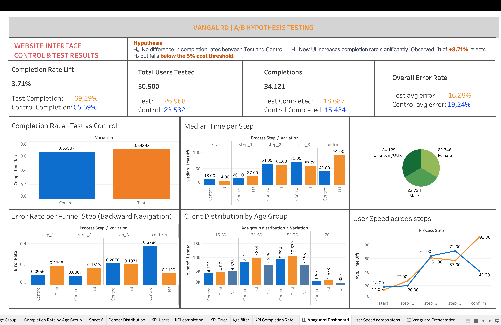

# Vanguard A/B Hypothesis Testing — Ironhack Data Analytics Project

## 📊 Tableau Dashboard Preview



## Overview

This project analyzes the results of a real-world A/B experiment conducted by **Vanguard**, one of the world's largest investment management companies. Vanguard tested a redesigned digital onboarding interface against their existing one to determine whether the new UI improved client completion rates.

The analysis covers funnel performance, error rates, time-on-step behavior, and demographic breakdowns — with formal hypothesis testing to validate findings.

---

## The Experiment

| | Detail |
|---|---|
| **Period** | March 15 – June 20, 2017 |enrolled - 70,609 clients
| **Control (A)** | Existing interface — 23,532 clients |
| **Test (B)** | Redesigned interface — 26,968 clients |
| **Total clients** | 50,500 (after data cleaning) |
| **Significance level** | α = 0.05 |

---

## Key Findings

| Metric | Control | Test | Result |
|---|---|---|---|
| Completion Rate | 65.59% | 69.29% | ✅ +3.71% lift |
| Error Rate (Confirm step) | 37.84% | 11.29% | ✅ -26% improvement |
| Median Time per Step | 35.0s | 34.0s | ➖ No significant change |
| Funnel retention | Baseline | +8–10% at every step | ✅ Improved |

### Hypothesis Results

**H1 — Completion Rate**
> H₀: Completion rates are similar between groups.
> H₁: The new UI increases completion rate significantly.
> **Result: Reject H₀** — p-value < 0.05. The new interface significantly improves completion rate. However, the +3.71% lift falls below the **5% cost-effectiveness threshold**.

**H2 — Demographic Fairness (Age)**
> H₀: Average age of Control and Test groups is similar.
> **Result: Fail to reject H₀ (practically)** — p = 0.016, but the mean age difference is only 0.34 years. Groups are demographically balanced.

**H3 — Time Spent on Steps**
> H₀: Median time per step is similar between groups.
> **Result: Fail to reject H₀** — p = 0.3765. The new UI does not slow users down.

---

## Project Structure

```
Vanguard-Assurance-UX-UI-Testing/
│
├── data_files/
│   ├── raw/                         # Original raw datasets
│   └── cleaned_tableau_exports/     # Cleaned datasets used in Tableau
│
├── jupyter notebooks/
│   ├── Contribution notebooks/      # Supporting analysis notebooks
│   ├── final code.ipynb             # Final data cleaning & transformation workflow
│   └── functions.py                # Reusable Python functions
│
├── tableau/
│   ├── Vanguard_Assurance_UX_UI_Test_Dashboard.twbx   # Tableau packaged workbook
│   └── screenshot_dashboard.png                      # Dashboard preview image
│
├── __pycache__/                    # Python cache files (auto-generated)
│
├── README.md                      # Project documentation
└── .gitignore                     # Files excluded from version control
```

---

## Tableau Dashboards

| | Link |
|---|---|
| 📊 **Interactive Dashboard** | [Vanguard Dashboard on Tableau Public](https://public.tableau.com/app/profile/selasey.dick.junior.gbeddy/viz/Vanguard_Assurance_UX_UI_Test_Dasboard/Dashboard1#1) |
---

## Dashboard Sheets

- **Test Completion rate** — Completion rate lift, total users, completions, error rate summary
- **Control Completion rate**
- **Test Error rate**
- **Control Error rate**
- **Total Users**
- **Completion difference**
- **Time Trend**
- **User Journey Funnel**
- **Completion vs Error rate**
- **Heatmap Error rate**
- **Gender Demographics**

---

## Tech Stack

| Tool | Usage |
|---|---|
| Python (pandas, scipy, statsmodels, seaborn) | Data cleaning, EDA, hypothesis testing |
| Jupyter Notebook | Analysis workflow |
| Tableau Public | Dashboard and story presentation |
| GitHub | Version control and project sharing |

---

## Statistical Methods

- **Two-proportion Z-test** — Completion rate comparison (H1)
- **Independent samples t-test** — Age distribution fairness check (H2)
- **Mann-Whitney U test** — Time-on-step comparison (H3, non-parametric due to skewed distribution)

---

## Authors

| Name | GitHub | Role |
|---|---|---|
| **Kanak Yadav** | [@Kanak2208](https://github.com/Kanak2208) | EDA, Data analysis, hypothesis testing, Tableau dashboards, presentation, Github |
| **Diego Fornero** | [furby990](https://github.com/furby990) | EDA, funnel analysis, presentation |
| **Selasey Junior** | [Selaseyjr](https://github.com/Selaseyjr) | EDA, Demographics analysis, hypothesis testing, Tableau dashboards, Github, presentation |

---

## How to Run

1. Clone the repository:
```bash
git clone https://github.com/Kanak2208/Ironhack_second_project.git
cd Ironhack_second_project
```

2. Install dependencies:
```bash
pip install pandas numpy scipy statsmodels matplotlib seaborn
```

3. Add raw data files to the `raw/` folder (not included in repo due to size)

4. Run the notebook:
```bash
jupyter notebook final.ipynb
```

5. Exported CSVs will appear in `tableau/` — open Tableau and connect to them

---

## Acknowledgements

Data sourced from the **Vanguard Digital Experiment Dataset** as part of the Ironhack Data Analytics Bootcamp, Berlin, 2026.

> *"The observed lift of +3.71% rejects H₀ but falls below the 5% cost threshold — the new UI is statistically better, but further monitoring is recommended before full rollout."*
